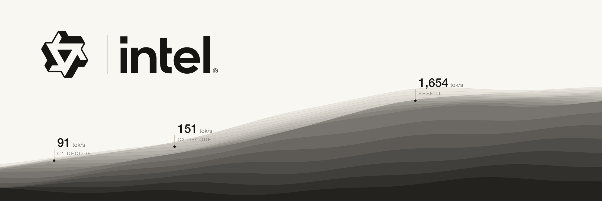

# exl3xpu



EXL3 ([exllamav3](https://github.com/turboderp-org/exllamav3) trellis quantization) inference on Intel Arc
Battlemage GPUs, as a vLLM plugin. Native ESIMD kernels decode the trellis bit-exactly and run the GEMMs
on the Xe2 vector and XMX units; vLLM supplies scheduling, paged KV cache, the GDN/attention kernels and the
OpenAI API.

Tested on Intel Arc Pro B70 (BMG-G31, 32 GB), vLLM 0.26.1 XPU
(`intel/llm-scaler-vllm:0.26.0-b2@sha256:52218ad85513ab6686d4c090c83c2bd8c5b02423c63aa4dabd41837fe641fe3b`),
host kernel 7.1.8 (xe), compute-runtime 26.31.39395.13, IGC 2.40.13, Level Zero loader 1.32.0.

## Results: Qwen3.8-27B EXL3 4.00bpw, one B70

Config [`models/qwen3.8-27b-exl3-4.00bpw/model.yaml`](models/qwen3.8-27b-exl3-4.00bpw/model.yaml):
MTP speculative decoding k=3 (the EXL3 MTP head shipped in the checkpoint, draft lm_head pruned to 512 vocab
blocks), fp8 KV cache (272,570 tokens in 1600-token blocks), max context 262,144, 16 sequences, image (4/prompt) and
video (1/prompt) input. Model revision `113cf7ab958054860e43fb7f3063b1af19171095` (branch `4.00bpw`).

Decode with thinking on, aggregate tok/s. C16 is KV-bound (about 10 of 16 long-reasoning streams fit the fp8 pool). Cold unique tokenizer-sized prompts, greedy, no output
cap, 60-90 s sustained windows (`bench/sweep.py`); raw rows in `bench/results/2026-09-23.jsonl`.

Realistic workload (Gutenberg books for prose, HumanEval for code, temperature 0.7, thinking on, up to 16K output),
aggregate tok/s; the synthetic greedy panel (random-word prompts, fixed tasks, 2K cap) in brackets:

| C | prose | code |
|---|---|---|
| 1 | **91.2** (76.6) | **66.1** (63.3) |
| 2 | **151.4** (136.2) | **125.3** (115.3) |
| 4 | **262.6** (248.7) | **212.9** (196.3) |
| 8 | **357.1** (362.6) | **321.7** (294.3) |
| 16 | **365.2** (409.9) | **350.0** (344.2) |

Cold prefill, one request (tok/s; prefix caching on, which the recipe needs for multi-turn agents):

| prompt | fp16 prefill, FA2 attention (2026-09-24 recipe) | int8 prefill + oneDNN attention (current) |
|---|---|---|
| 4K | 1,654 | **2,421** |
| 32K | 1,434 | **2,259** |
| 128K | 928 | **1,415** |
| 254K | 650 | **911** |

oneDNN attention alone, same build and day vs FA2: +10% / +7% / +15% / +18% (4K / 32K / 128K / 254K). Needle
retrieval 3/3 at 131K and 3/3 at 240K.

Real agent traffic (40 recorded omp sessions replayed turn by turn with tools, thinking on, temperature 1;
2 sessions x 12 turns, prompts 18K median / 63K max): 24/24 turns ok, every turn a tool call, no loops.
TTFT p50 / p95 4.65 / 9.00 s with fp16 prefill, **3.78 / 8.30 s** with int8 prefill; the 24 turns took 193 s vs
**147 s**. Raw rows in `docs/PROGRESS.md` ("omp session replay").

### Prefill: int8 linears and oneDNN fused attention (on by default)

Prefill linears (more than 128 tokens) can run in int8 on the XMX units at twice the fp16 rate. The GEMM already
runs in the Hadamard domain, where activations have no outliers, and every mul1 codebook value is bounded by
3.453125, so activations get one int8 scale per row (fused into the input Hadamard) and weights one static scale
(fused into reconstruct); oneDNN runs the s8 GEMM with both scales applied and writes fp16. All linears at 4,096
tokens: 1,748 -> 926 ms (1.89x). Cost: teacher-forced NLL on real text +0.17% (1.6439 -> 1.6467), top-1 agreement
with fp16 prefill 97.2%. Decode is unchanged and stays bit-exact.

Long-prefix attention (fp8 KV cache) runs through a oneDNN Graph fused SDPA (`EXL3_ONEDNN_ATTN`): one call per KV head
over the whole sequence with a bottom-right causal mask, ~80-90 TFLOPS at head_dim 256 vs ~65-70 for FA2.

Both are on in `model.yaml` (`EXL3_INT8_PREFILL: "1"`); set either to `"0"` there to go back to fp16 prefill / FA2 (model.yaml env overrides `docker -e`).

Same card, tuned llama.cpp SYCL Q4_K_M (`qwen38-q4km-arcb70-llamacpp-tp1`): C1 25.0, C8 56.8, C16 56.0
aggregate; prefill 4K 999, 32K 629 tok/s.

## Correctness

- Dequantized weights are **bit-identical** to exllamav3's `reconstruct()` for all 401 EXL3 tensors of the
  checkpoint (25.6G weights) on every kernel path: `tests/test_bitexact_xpu.py`. The pure-PyTorch
  reference (`exl3xpu/ref.py`) is validated bit-exact against exllamav3's CUDA kernels on an RTX 3090
  (`tests/oracle_cuda.py`).
- End-to-end logits vs exllamav3 on a 3090 (teacher-forced, sealed 64x256 panel): `tests/gateA3/`.

## Layout

```
exl3xpu/          core, model-agnostic
  vllm_plugin.py    `exl3` quantization config + linear method (fused shards, lm_head), vLLM entry point
  ops.py            torch custom op: dispatch M<=128 fused GEMM, else reconstruct + oneDNN GEMM
  ref.py            bit-exact PyTorch reference decoder (the spec)
  triton_kernels.py portable fallback kernels
csrc/             ESIMD kernels (Hadamard in/out, dp4a GEMV, DPAS GEMM, reconstruct) + torch bindings
models/<id>/      one directory per served model: model.yaml (serving config), recipe.json (measured)
scripts/          build_ext.sh, serve.py (config -> vllm serve), lb.py (data-parallel proxy), stop.sh
bench/sweep.py    saturation sweep (decode per-stream/aggregate, cold prefill, GPU busy flags)
tests/            oracle vs CUDA, bit-exactness on XPU, kernel timing, Gate A3 logits panel
docs/             DESIGN.md (format + kernels), GOAL.md, PROGRESS.md (tuning log)
```

## Run

Published, attested image (built by `.github/workflows/release-image.yml` from this repo; verify with
`gh attestation verify oci://ghcr.io/0xsero/exl3xpu@sha256:21412bdd7535e9c653eeb3d099dce3bc79a83d440def2cd9556111c79c870fa8 -o 0xSero`):

```bash
IMG=ghcr.io/0xsero/exl3xpu@sha256:21412bdd7535e9c653eeb3d099dce3bc79a83d440def2cd9556111c79c870fa8
hf download turboderp/Qwen3.8-27B-exl3 --revision 113cf7ab958054860e43fb7f3063b1af19171095 \
  --local-dir $MODELS/turboderp-Qwen3.8-27B-exl3-4.00bpw

# one card, OpenAI API on :8000 (tool calls + reasoning parsed)
docker run --rm --device /dev/dri -v /dev/dri/by-path:/dev/dri/by-path:ro --shm-size 32g -p 8000:8000 \
  -e HF_HUB_OFFLINE=1 -v $MODELS/turboderp-Qwen3.8-27B-exl3-4.00bpw:/models:ro $IMG \
  models/qwen3.8-27b-exl3-4.00bpw --gpu 0 --port 8000 --model-path /models \
  -- --enable-prefix-caching --enable-auto-tool-choice --tool-call-parser qwen3_coder --reasoning-parser qwen3
```

- `/dev/dri/by-path` must be mounted: oneCCL enumerates devices through it. To pin one card on a multi-GPU
  host, pass only that card's render node (`--device /dev/dri/renderDNNN`) and mount a `by-path` directory that
  holds only that card's link (this is what the Omarchy local-ai plugin does).
- Serving config (MTP k=3, fp8 KV in 1600-token blocks, 262,144 context, 16 sequences, 4096-token prefill
  chunks, 32 images / 4 videos per request, images capped at 4.2 MP) is `models/qwen3.8-27b-exl3-4.00bpw/model.yaml`;
  `python3 scripts/serve.py models/qwen3.8-27b-exl3-4.00bpw --gpu 0 --print` shows the exact `vllm serve` command.
- Build it yourself from the repository root: `docker build -f xpu/docker/Dockerfile -t exl3xpu .` (base image pinned by digest), or inside any
  vLLM XPU environment with oneAPI 2025.3: `pip install -e core && cd xpu && scripts/build_ext.sh && pip install -e .`.
- Both cards as two replicas behind a proxy: `... models/qwen3.8-27b-exl3-4.00bpw --dp --model-path /models`.

## Reproduce the numbers and the gates

```bash
bench/fetch_corpus.sh                                   # Gutenberg books + HumanEval (not committed)
# realistic headline panel (thinking on, temperature 0.7)
python3 bench/sweep.py --base http://localhost:8000 --decode-c 1,2,4,8,16 --classes prose,code --thinking \
  --corpus real --temperature 0.7 --max-tokens 16384 --skip-prefill
# synthetic greedy reference panel, and cold prefill
python3 bench/sweep.py --base http://localhost:8000 --decode-c 1,2,4,8,16 --classes prose,code --thinking --skip-prefill
python3 bench/sweep.py --base http://localhost:8000 --skip-decode --prefill-c 1 --prefill-ctx 4096,32768,131072,253952
python3 bench/interleave.py --base http://localhost:8000 --streams 4 --interval 30 --sizes 1024,8192,32768
python3 bench/vision_bench.py --base http://localhost:8000
python3 bench/linear_budget.py 1 4 16 64               # kernel-only time of all EXL3 linears
python3 tests/test_bitexact_xpu.py                     # Gate A1: every kernel path vs exllamav3 reconstruct
python3 tests/test_needle.py http://localhost:8000 131072; python3 tests/test_vision.py http://localhost:8000
python3 bench/longctx.py --base http://localhost:8000 --ctx 131072,200000   # cold + same-document warm turn, decode after TTFT
EXL3_INT8_PREFILL=1 python3 tests/test_int8_prefill.py 4096   # int8 kernels vs a torch reference, time per layer
python3 tests/prefill_nll.py --base http://localhost:8000 --out a.json [--compare b.json]  # prefill numerics A/B
```

Raw rows of every measurement are in `bench/results/`; every kept and rejected step, with numbers, is in
`docs/PROGRESS.md`.

## Adding a model

Create `models/<id>/model.yaml` (copy the Qwen one): source repo + revision, vLLM args, env, parallel
layout. The core needs no changes as long as the checkpoint is EXL3 with the `mul1` codebook at 4 or 6 bpw
(build with `EXL3_FLAGS=-DEXL3_ALL_CODEBOOKS` for 2/3/5 bpw and the mcg/3INST codebooks), all linear dims
are multiples of 128, and vLLM already implements the architecture. Tensor parallelism is not supported yet;
use data parallel.

## Status

Validated and recommended B70 recipe in [local-ai-registry](https://github.com/0xSero/local-ai-registry)
(`qwen38-27b-exl3-4bpw-arcb70-vllm-exl3xpu-tp1`). Weights bit-exact vs exllamav3 on every kernel path
(vector M=1/2/4, DPAS M=3..64); logits vs exllamav3 on a 3090: top-1 99.63%, KL 9.8e-5. Vision (32 numbered
images read back in order), video and a 128K needle test pass. Open items: 254K prefill (911 tok/s) is bound by attention
(~80 TFLOPS fp16; int8 QK^T is the next step); at C16 with thinking on ~14 of 16 streams fit the KV pool.
Log in `docs/PROGRESS.md`.
